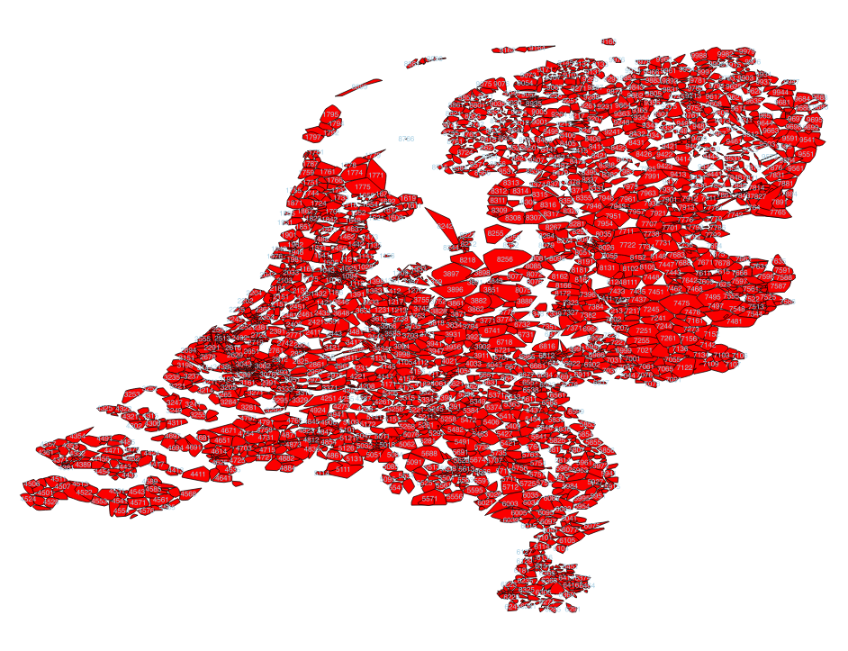
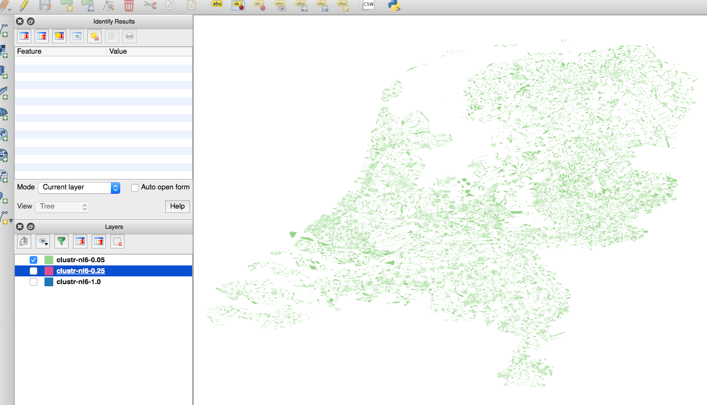
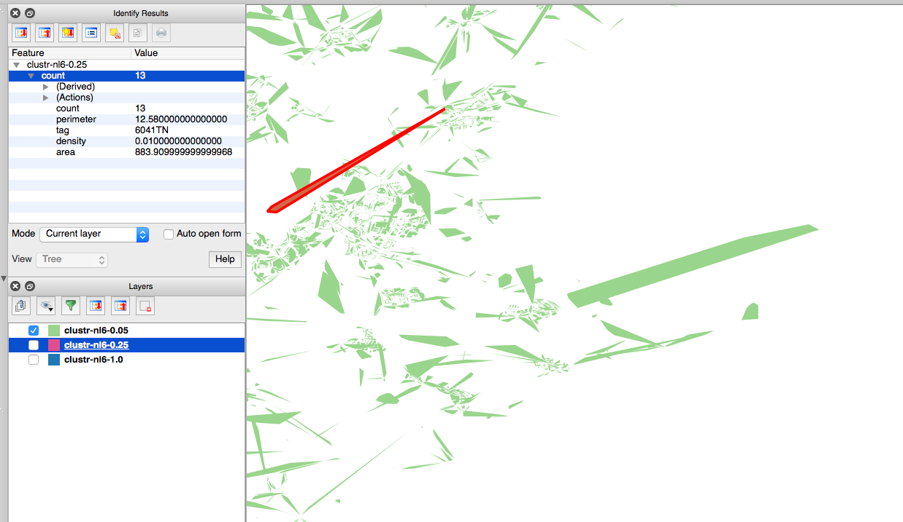
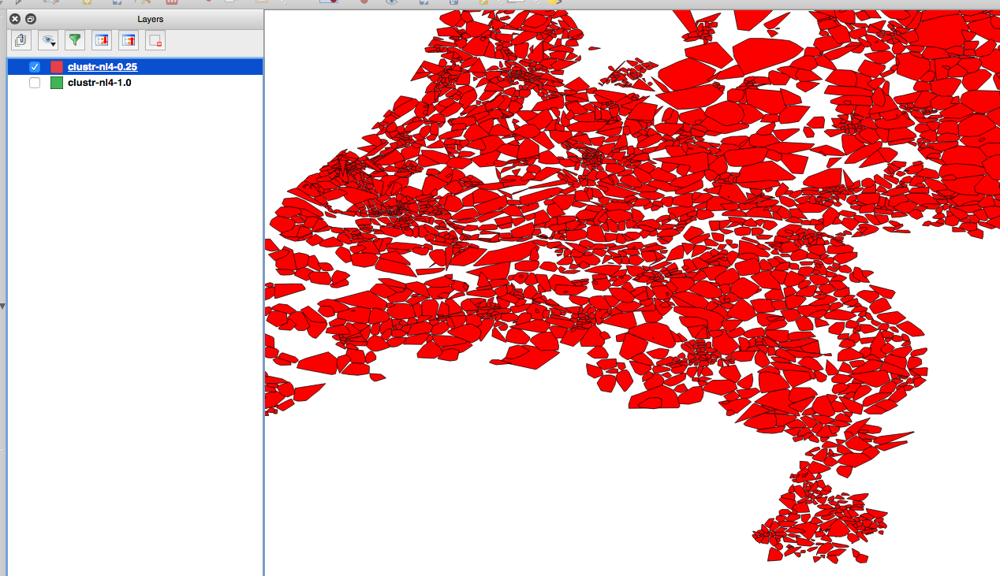

# whosonfirst-data-postalcode-nl

Who's On First postal code data for the Netherlands (NL)

## About the data

This dataset is incomplete and approximate.

Specifically of the [371, 628 records](data) included in this repository 1, 089 of them lack any geographic data. They are ["visiting Null Island"](https://whosonfirst.mapzen.com/spelunker/nullisland/?iso=nl) so to speak. Another 1, 773 records only have single coordinate point rather than a polygon.

366, 843 records are 6-character postal codes which, [according to Wikipedia](), "on average ... comprises eight single addresses". 4, 785 records are the 4-character container postal codes representing region and locality information.

All of these records have geometries that were derived from the available address data for Netherlands [as provided by OpenAddresses](https://results.openaddresses.io/) on July 23, 2016 which was used to generate polygons using the [Clustr](https://github.com/whosonfirst/Clustr) tool.

All geometries generated using the Clustr tool should be considered approximate as denoted by the `mz:is_approximate` and `mz:is_clustr` properties. In time we expect (hope) that these records will be updated with current and authoritative data provided by the Dutch postal service.

Some records may lack geometries because Clustr was unable to generate a polygon or because the polygon generated was determined to be too large. For example, any polygon for a 6-character code with a perimeter value >= 6 was rejected. For example:

When and where this happened for 6-character postal codes an attempt was made to use the centroid of the parent 4-character postal code as a substitute. These too are marked as `mz:is_approximate`.

It's not perfectntil then these geometries are [at least more accurate]() than "all of the Netherlands" and have been assigned [full hierarchies]() in Who's On First land.

## See also

* https://github.com/whosonfirst-data/whosonfirst-data-postalcode
* https://en.wikipedia.org/wiki/Postal_codes_in_the_Netherlands